# MVP — Engenharia de Dados: Pipeline de Risco de Crédito na Nuvem

**Aluna:** Bárbara
**Curso:** Pós-graduação em Ciência de Dados e Analytics — PUC-Rio
**Disciplina:** Engenharia de Dados
**Repositório:** `credit-risk-data-pipeline`
**Plataforma utilizada:** Databricks Free Edition (catálogo `credit_risk_pipeline`)

---

## Sumário

1. [Contexto de Negócio e Perguntas (Etapa 2 e 4.1)](#1-contexto-de-negócio-e-perguntas-etapa-2-e-41)
2. [Carga dos Dados (Etapa 4.2)](#2-carga-dos-dados-etapa-42)
3. [Modelagem e Catálogo de Dados (Etapa 4.3)](#3-modelagem-e-catálogo-de-dados-etapa-43)
4. [Pipeline de Dados (Etapa 4.4)](#4-pipeline-de-dados-etapa-44)
5. [Qualidade de Dados (Etapa 4.5)](#5-qualidade-de-dados-etapa-45)
6. [Análise de Dados (Etapa 4.5)](#6-análise-de-dados-etapa-45)
7. [Autoavaliação](#7-autoavaliação)

---

## 1. Contexto de Negócio e Perguntas (Etapa 2 e 4.1)

### Problema

Instituições de crédito precisam decidir, no momento da concessão de um empréstimo, qual a probabilidade de um cliente não conseguir honrar o pagamento. Decisões mal informadas nessa etapa geram dois tipos de prejuízo: conceder crédito a quem não vai pagar (inadimplência) ou negar crédito a quem pagaria normalmente (perda de receita e exclusão financeira).

Este MVP constrói um pipeline de dados de ponta a ponta que organiza informações de propostas de crédito, histórico em outras instituições (bureau) e comportamento de pagamento, para permitir a análise dos fatores associados ao risco de inadimplência.

### Perguntas de negócio

1. **Qual a taxa geral de inadimplência e como ela varia por tipo de contrato e nível de escolaridade do cliente?**
2. **Clientes com histórico de atraso em outras instituições (bureau de crédito) apresentam maior taxa de inadimplência no crédito atual?**
3. **O comportamento de pagamento em propostas anteriores (parcelas atrasadas) está associado a maior risco no crédito atual?**
4. **Como a exposição financeira (valor total emprestado e valor em risco) se distribui entre segmentos de idade, renda e valor do crédito?**

### Fonte dos dados

Os dados utilizados vêm do dataset **Home Credit Default Risk**, disponibilizado pela Kaggle (competição hospedada pela Home Credit Group): https://www.kaggle.com/c/home-credit-default-risk

**Licença:** o dataset está sob os termos "Subject to Competition Rules" da Kaggle — uso liberado para fins educacionais, acadêmicos e de pesquisa dentro do escopo da competição, sem permissão para redistribuição comercial dos dados brutos. Este trabalho tem finalidade estritamente acadêmica (MVP da disciplina de Engenharia de Dados).

### Estrutura dos dados brutos

Foram utilizados 4 dos arquivos CSV originais do dataset:

| Arquivo | Conteúdo | Granularidade |
|---|---|---|
| `application_train.csv` | Dados da proposta de crédito atual e perfil sociodemográfico do cliente | 1 linha por cliente (`SK_ID_CURR`) |
| `bureau.csv` | Histórico de créditos do cliente em outras instituições financeiras | 1 linha por crédito externo (`SK_ID_BUREAU`) |
| `previous_application.csv` | Propostas de crédito anteriores do cliente junto à própria instituição | 1 linha por proposta anterior (`SK_ID_PREV`) |
| `installments_payments.csv` | Histórico de parcelas e pagamentos realizados | 1 linha por parcela |

---

## 2. Carga dos Dados (Etapa 4.2)

Os 4 arquivos CSV foram enviados para um Volume do Unity Catalog (`/Volumes/credit_risk_pipeline/bronze/raw_files/`) e, em seguida, ingeridos via PySpark no notebook [`01_bronze_ingestao.ipynb`](./01_bronze_ingestao.ipynb).

O processo de ingestão:
- Lê cada CSV com inferência automática de schema (`inferSchema`) e cabeçalho (`header`).
- Adiciona duas colunas de controle de metadados: `_ingestion_timestamp` (data/hora da ingestão) e `_source_file` (nome do arquivo de origem), garantindo rastreabilidade.
- Grava cada arquivo como uma tabela Delta separada no schema `bronze`, sem qualquer alteração de valores — preservando os dados exatamente como vieram da fonte.

Tabelas geradas: `credit_risk_pipeline.bronze.application`, `bureau`, `previous_application`, `installments_payments`.

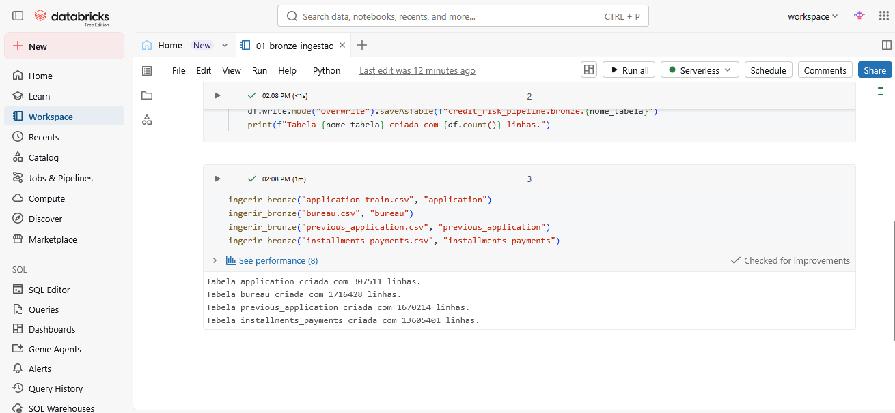
*Execução do notebook `01_bronze_ingestao.ipynb`: os 4 arquivos CSV originais foram carregados com sucesso — `application` (307.511 linhas), `bureau` (1.716.428 linhas), `previous_application` (1.670.214 linhas) e `installments_payments` (13.605.401 linhas).*

---

## 3. Modelagem e Catálogo de Dados (Etapa 4.3)

### Estratégia de modelagem

Para viabilizar o processamento dentro dos limites do Databricks Free Edition, foi extraída uma **amostra de 13% dos clientes** (`credit_risk_pipeline.silver.clientes_amostra`) a partir da tabela `bronze.application`, com seed fixa (`seed=42`) para reprodutibilidade. Essa amostra foi validada comparando a taxa de inadimplência da base completa com a da amostra, confirmando que a proporção de clientes inadimplentes (`TARGET`) se manteve equivalente — preservando a representatividade estatística do recorte.

Todas as demais tabelas Silver e Gold foram construídas a partir dessa amostra de clientes, unida (`join`) às tabelas Bronze correspondentes.

O modelo segue uma lógica próxima ao **Esquema Estrela**: a tabela `gold.perfil_risco_cliente` funciona como uma visão consolidada por cliente (uma linha por `SK_ID_CURR`), enriquecida com métricas agregadas de bureau, propostas anteriores e pagamentos — e a tabela `gold.indicadores_risco` funciona como uma tabela fato agregada por segmento (faixa etária × faixa de renda × faixa de valor de crédito).

### Catálogo de Dados

#### `silver.application`
Perfil do cliente e dados da proposta de crédito atual, para a amostra selecionada.

| Campo | Tipo | Descrição / Domínio |
|---|---|---|
| SK_ID_CURR | inteiro | Identificador único do cliente |
| TARGET | inteiro (0/1) | 1 = cliente com dificuldade de pagamento; 0 = pagamento em dia |
| NAME_CONTRACT_TYPE | texto | Tipo de contrato: "Cash loans" ou "Revolving loans" |
| CODE_GENDER | texto | Gênero do cliente (M/F) |
| FLAG_OWN_CAR | texto (Y/N) | Se o cliente possui carro |
| FLAG_OWN_REALTY | texto (Y/N) | Se o cliente possui imóvel |
| CNT_CHILDREN | inteiro | Número de filhos |
| AMT_INCOME_TOTAL | decimal | Renda total anual declarada |
| AMT_CREDIT | decimal | Valor do crédito solicitado |
| AMT_ANNUITY | decimal | Valor da parcela (anuidade) do crédito |
| AMT_GOODS_PRICE | decimal | Valor do bem sendo financiado |
| NAME_INCOME_TYPE | texto | Categoria da fonte de renda (ex.: "Working", "Pensioner") |
| NAME_EDUCATION_TYPE | texto | Nível de escolaridade |
| NAME_FAMILY_STATUS | texto | Estado civil |
| NAME_HOUSING_TYPE | texto | Tipo de moradia |
| OCCUPATION_TYPE | texto | Ocupação profissional |
| CNT_FAM_MEMBERS | decimal | Número de membros na família |
| REGION_RATING_CLIENT | inteiro (1–3) | Classificação de risco da região onde o cliente reside |
| ORGANIZATION_TYPE | texto | Tipo de organização empregadora |
| EXT_SOURCE_1/2/3 | decimal (0–1) | Score normalizado de fontes externas de crédito |
| idade_anos | inteiro | Idade do cliente em anos (derivado de `DAYS_BIRTH`) |
| anos_empregado | inteiro | Tempo de emprego em anos (derivado de `DAYS_EMPLOYED`; nulo quando o valor original era um código de "não aplicável") |

**Linhagem:** `bronze.application` → filtro pela amostra de clientes → seleção de colunas relevantes → tratamento de "XNA" como nulo → conversão de `DAYS_BIRTH`/`DAYS_EMPLOYED` (negativos, em dias) para `idade_anos`/`anos_empregado` (positivos, em anos).

#### `silver.bureau`
Histórico de créditos do cliente em outras instituições.

| Campo | Tipo | Descrição / Domínio |
|---|---|---|
| SK_ID_BUREAU | inteiro | Identificador do crédito externo |
| SK_ID_CURR | inteiro | Identificador do cliente (chave de junção) |
| CREDIT_ACTIVE | texto | Status do crédito: "Active", "Closed", "Sold", "Bad debt" |
| DAYS_CREDIT | inteiro | Dias entre a abertura do crédito e a proposta atual |
| CREDIT_DAY_OVERDUE | inteiro | Dias de atraso no crédito externo |
| AMT_CREDIT_SUM | decimal | Valor total do crédito externo |
| AMT_CREDIT_SUM_DEBT | decimal | Saldo devedor atual (nulo tratado como 0) |
| AMT_CREDIT_SUM_OVERDUE | decimal | Valor em atraso (nulo tratado como 0) |
| AMT_CREDIT_MAX_OVERDUE | decimal | Maior valor já em atraso (nulo tratado como 0) |
| CREDIT_TYPE | texto | Tipo de crédito externo |

**Linhagem:** `bronze.bureau` → filtro pela amostra de clientes → seleção de colunas relevantes → preenchimento de nulos financeiros com 0 (ausência de registro de dívida/atraso = sem dívida/atraso).

#### `silver.previous_application`
Propostas de crédito anteriores do cliente na própria instituição.

| Campo | Tipo | Descrição / Domínio |
|---|---|---|
| SK_ID_PREV | inteiro | Identificador da proposta anterior |
| SK_ID_CURR | inteiro | Identificador do cliente |
| NAME_CONTRACT_TYPE | texto | Tipo de contrato da proposta anterior |
| AMT_APPLICATION | decimal | Valor solicitado |
| AMT_CREDIT | decimal | Valor efetivamente concedido |
| AMT_ANNUITY | decimal | Valor da parcela |
| NAME_CONTRACT_STATUS | texto | Status: "Approved", "Refused", "Canceled", "Unused offer" |
| DAYS_DECISION | inteiro | Dias entre a decisão e a proposta atual |
| NAME_CASH_LOAN_PURPOSE | texto | Finalidade do crédito |
| CODE_REJECT_REASON | texto | Motivo da recusa, quando aplicável |
| CNT_PAYMENT | decimal | Número de parcelas |

**Linhagem:** `bronze.previous_application` → filtro pela amostra de clientes → seleção de colunas relevantes → tratamento de "XNA" como nulo.

#### `silver.installments_payments`
Histórico de parcelas e pagamentos.

| Campo | Tipo | Descrição / Domínio |
|---|---|---|
| SK_ID_PREV | inteiro | Identificador da proposta associada |
| SK_ID_CURR | inteiro | Identificador do cliente |
| NUM_INSTALMENT_NUMBER | inteiro | Número sequencial da parcela |
| DAYS_INSTALMENT | inteiro | Dia previsto de vencimento (relativo à proposta) |
| DAYS_ENTRY_PAYMENT | inteiro | Dia em que o pagamento foi efetivamente registrado |
| AMT_INSTALMENT | decimal | Valor previsto da parcela |
| AMT_PAYMENT | decimal | Valor efetivamente pago |
| parcela_paga | booleano | Derivado: verdadeiro se `AMT_PAYMENT` não é nulo |
| atraso_dias | inteiro | Derivado: `DAYS_ENTRY_PAYMENT - DAYS_INSTALMENT` (positivo = pago com atraso) |
| valor_nao_pago | decimal | Derivado: `AMT_INSTALMENT - AMT_PAYMENT` |

**Linhagem:** `bronze.installments_payments` → filtro pela amostra de clientes → seleção de colunas relevantes → cálculo de `parcela_paga`, `atraso_dias` e `valor_nao_pago`.

#### `gold.perfil_risco_cliente`
Visão consolidada de risco por cliente (uma linha por `SK_ID_CURR`), combinando `silver.application` com métricas agregadas das demais tabelas Silver.

| Campo | Tipo | Descrição / Domínio |
|---|---|---|
| *(todas as colunas de `silver.application`)* | — | Herdadas da tabela de perfil do cliente |
| qtd_creditos_bureau | inteiro | Quantidade de créditos externos registrados (0 se nenhum) |
| qtd_creditos_ativos_bureau | inteiro | Quantidade de créditos externos ativos |
| atraso_medio_dias_bureau | decimal | Média de dias de atraso nos créditos externos (nulo se sem histórico) |
| valor_total_overdue_bureau | decimal | Soma dos valores em atraso no bureau |
| qtd_propostas_anteriores | inteiro | Quantidade de propostas anteriores na instituição |
| qtd_propostas_aprovadas | inteiro | Quantidade de propostas anteriores aprovadas |
| valor_medio_solicitado_anterior | decimal | Valor médio solicitado em propostas anteriores |
| taxa_aprovacao_anterior | decimal (0–1) | `qtd_propostas_aprovadas / qtd_propostas_anteriores` |
| qtd_parcelas_pagas | inteiro | Quantidade de parcelas pagas historicamente |
| atraso_medio_dias_pagamento | decimal | Média de atraso nas parcelas pagas |
| pct_parcelas_atrasadas | decimal (0–1) | Percentual de parcelas pagas com atraso |

**Linhagem:** `silver.application` `LEFT JOIN` agregação de `silver.bureau` `LEFT JOIN` agregação de `silver.previous_application` `LEFT JOIN` agregação de `silver.installments_payments`, todas por `SK_ID_CURR`, com preenchimento de nulos numéricos por 0 (ausência de registro = ausência do evento).

#### `gold.indicadores_risco`
Tabela fato agregada por segmento, para análise de exposição financeira.

| Campo | Tipo | Descrição / Domínio |
|---|---|---|
| faixa_etaria | texto | "até 29" / "30 a 44" / "45 a 59" / "60 ou mais" |
| faixa_renda | texto | "baixa" / "média" / "alta" (tercis de `AMT_INCOME_TOTAL`) |
| faixa_valor_credito | texto | "baixo" / "médio" / "alto" (tercis de `AMT_CREDIT`) |
| qtd_clientes | inteiro | Quantidade de clientes no segmento |
| qtd_inadimplentes | inteiro | Quantidade de clientes com `TARGET = 1` no segmento |
| taxa_inadimplencia | decimal (0–1) | Proporção de inadimplentes no segmento |
| exposicao_total_credito | decimal | Soma do valor de crédito concedido no segmento |
| exposicao_em_risco | decimal | Soma do valor de crédito concedido a clientes inadimplentes no segmento |

**Linhagem:** `gold.perfil_risco_cliente` → segmentação por faixa etária (regras fixas) e por tercis de renda/valor de crédito (calculados via `approxQuantile`) → agregação por segmento.

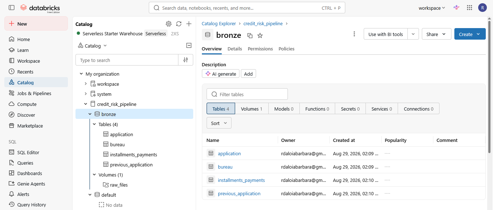
*Catalog Explorer do Databricks: catálogo `credit_risk_pipeline`, schema `bronze`, com as 4 tabelas Delta criadas e o Volume `raw_files` utilizado para armazenar os CSVs originais antes da ingestão.*

---

## 4. Pipeline de Dados (Etapa 4.4)

O pipeline foi ramificado em **5 notebooks**, cada um representando uma etapa lógica da arquitetura medalhão, disponíveis no repositório:

| Notebook | Papel |
|---|---|
| [`01_bronze_ingestao.ipynb`](./01_bronze_ingestao.ipynb) | Extract + Load bruto: lê os 4 CSVs e grava como tabelas Delta na camada Bronze, sem transformação de valores. |
| [`02_silver_amostra_clientes.ipynb`](./02_silver_amostra_clientes.ipynb) | Transform: define a amostra de clientes (13%, seed fixa), valida sua representatividade e aplica limpeza/padronização (tratamento de "XNA", conversão de dias para anos, tratamento de nulos financeiros) em cada uma das 4 tabelas Silver. |
| [`03_gold_modelagem.ipynb`](./03_gold_modelagem.ipynb) | Transform + Load final: agrega as tabelas Silver em métricas por cliente (`gold.perfil_risco_cliente`) e por segmento (`gold.indicadores_risco`). |
| [`04_qualidade_dados.ipynb`](./04_qualidade_dados.ipynb) | Verificação de qualidade das tabelas Silver (completude, unicidade, acurácia/outliers). |
| [`05_analise_final.ipynb`](./05_analise_final.ipynb) | Consultas SQL sobre a camada Gold respondendo cada uma das 4 perguntas de negócio. |

Optei por ramificar em notebooks separados (em vez de um único notebook monolítico) para manter cada etapa da arquitetura medalhão isolada e fácil de reexecutar independentemente — por exemplo, se a lógica de qualidade de dados precisar ser ajustada, não é necessário reprocessar a ingestão Bronze novamente.

Todas as tabelas são persistidas como tabelas Delta gerenciadas dentro do catálogo `credit_risk_pipeline`, organizadas nos schemas `bronze`, `silver` e `gold`.

A evidência de execução e persistência das tabelas Bronze está no print da Seção 2 acima. As tabelas Silver e Gold seguem o mesmo padrão de execução (`saveAsTable` com print da contagem de linhas ao final de cada célula) e podem ser conferidas no próprio Unity Catalog, navegando até os schemas `silver` e `gold` do catálogo `credit_risk_pipeline`.

---

## 5. Qualidade de Dados (Etapa 4.5)

A verificação de qualidade foi feita no notebook [`04_qualidade_dados.ipynb`](./04_qualidade_dados.ipynb), cobrindo as 4 tabelas da camada Silver, avaliando:

- **Completude:** percentual de valores nulos por coluna, calculado para todas as colunas de cada tabela.
- **Unicidade:** verificação de chaves duplicadas (`SK_ID_CURR` em `application`, `SK_ID_BUREAU` em `bureau`, `SK_ID_PREV` em `previous_application`).
- **Acurácia / Outliers:** análise de estatísticas descritivas (mínimo, quartis, máximo) das principais colunas numéricas (renda, valor de crédito, valor de parcela, idade, dias de atraso), para identificar valores fora do esperado.
- **Consistência categórica:** varredura de valores "XNA" (código usado no dataset original para "não informado/não aplicável") nas colunas categóricas de `application`.

### Problemas identificados e tratamentos aplicados

| Problema encontrado | Tabela | Tratamento aplicado |
|---|---|---|
| Valor `DAYS_EMPLOYED = 365243` — código de erro conhecido do dataset original, usado quando o campo não se aplica (ex.: aposentados) | `silver.application` | Convertido para nulo antes de calcular `anos_empregado`, evitando distorcer a estatística (365243 dias equivaleriam a ~1000 anos de emprego) |
| Categoria "XNA" (não informado) em colunas como gênero e tipo de organização | `silver.application`, `silver.previous_application` | Substituído por nulo, para não ser tratado como uma categoria válida nas análises — a checagem de qualidade confirmou 0 ocorrências de "XNA" remanescentes nas colunas categóricas de `application`, validando que o tratamento aplicado na Silver funcionou |
| Valores nulos em colunas financeiras do bureau (dívida, atraso) quando o cliente não possui registro correspondente | `silver.bureau` | Preenchidos com 0, já que ausência de registro representa ausência de dívida/atraso, e não dado faltante por erro |
| Nenhuma duplicata de chave encontrada em nenhuma das 4 tabelas | `silver.application`, `silver.bureau`, `silver.previous_application` | Verificado: 0 duplicatas em `SK_ID_CURR` (39.773 clientes), 0 em `SK_ID_BUREAU` (189.943 registros) e 0 em `SK_ID_PREV` (182.730 propostas) — não foi necessário nenhum tratamento |
| Outlier em `AMT_INCOME_TOTAL`: valor máximo de **R$ 18.000.090**, muito acima da mediana (R$ 147.150) e do 75º percentil (R$ 202.500) | `silver.application` | Identificado na análise descritiva; mantido na base sem remoção, mas sinalizado como outlier a ser considerado com cautela em análises estatísticas sensíveis a valores extremos (ex.: médias). As demais colunas numéricas (`AMT_CREDIT`, `AMT_ANNUITY`, `idade_anos`) não apresentaram valores fora do esperado — idades entre 21 e 69 anos, valores de crédito e parcela em faixas plausíveis |
| Outlier em `CREDIT_DAY_OVERDUE`: valor máximo de **2.754 dias** (~7,5 anos) de atraso em um crédito externo, enquanto a mediana é 0 | `silver.bureau` | Mantido na base (representa um caso real de inadimplência extrema), mas sinalizado como outlier — a grande maioria dos registros (75º percentil = 0) não apresenta atraso algum, o que é coerente com o esperado |
| Inconsistência lógica em `AMT_CREDIT_SUM_DEBT`: valor mínimo **negativo** (R$ -440.426,84), o que não faz sentido para um saldo devedor | `silver.bureau` | **Identificado, mas ainda não corrigido na versão atual do pipeline.** Recomenda-se tratar como um erro de lançamento na fonte (possível estorno ou erro de sinal) — como trabalho futuro, aplicar `GREATEST(AMT_CREDIT_SUM_DEBT, 0)` ou investigar a causa antes de usar essa coluna em análises agregadas |
| Outlier em `atraso_dias`: valores extremos em ambas as direções — mínimo de **-1.335 dias** (parcela paga com mais de 3 anos de antecedência) e máximo de **2.737 dias** (~7,5 anos de atraso) | `silver.installments_payments` | Mantidos na base; a mediana de -6 dias mostra que, tipicamente, os clientes pagam poucos dias antes do vencimento, o que é o padrão esperado — os extremos são sinalizados como outliers pontuais, não como um padrão sistêmico |

**Completude:** todas as colunas de `silver.application` apresentaram completude praticamente total, exceto `CODE_GENDER`, com apenas ~0,25% de valores nulos — percentual residual e sem impacto relevante nas análises. As demais tabelas (`bureau`, `previous_application`, `installments_payments`) não apresentaram problemas de completude relevantes nas colunas numéricas analisadas.

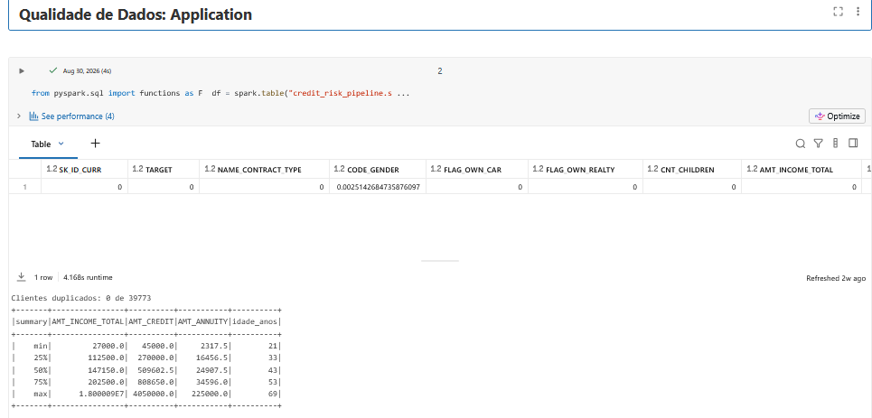
*Resultado da checagem de qualidade de `silver.application`: completude por coluna (destaque para `CODE_GENDER`, único campo com nulos), 0 clientes duplicados de 39.773, e o `summary` estatístico de renda, crédito, parcela e idade — evidenciando o outlier no valor máximo de `AMT_INCOME_TOTAL`.*

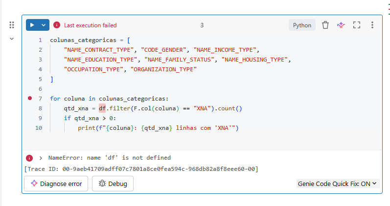
*Verificação de consistência categórica: nenhuma linha impressa significa que a contagem de "XNA" deu zero em todas as colunas categóricas de `application`, confirmando que o tratamento aplicado na camada Silver funcionou.*

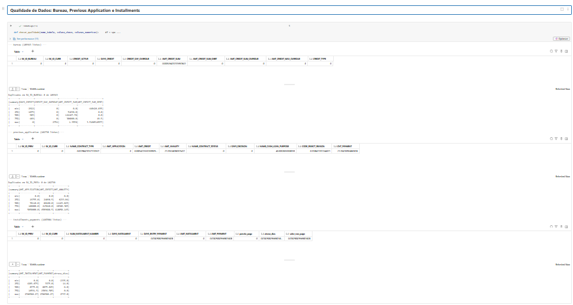

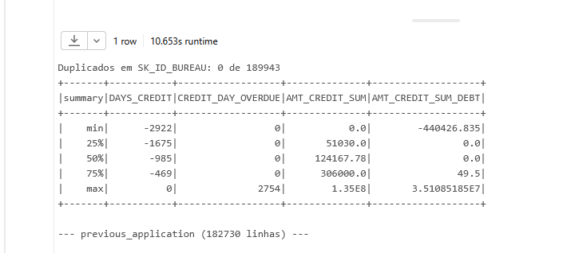
*`silver.bureau`: 0 duplicatas em `SK_ID_BUREAU` (189.943 registros). Destaque para os outliers em `CREDIT_DAY_OVERDUE` (máximo de 2.754 dias de atraso) e o valor mínimo negativo em `AMT_CREDIT_SUM_DEBT` (-R$ 440.426,84).*

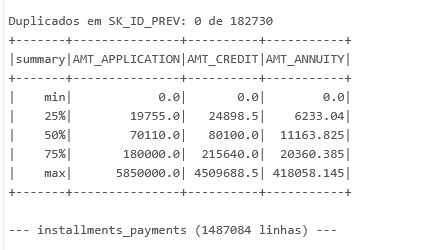
*`silver.previous_application`: 0 duplicatas em `SK_ID_PREV` (182.730 propostas). Valores de `AMT_APPLICATION`, `AMT_CREDIT` e `AMT_ANNUITY` dentro de faixas plausíveis.*

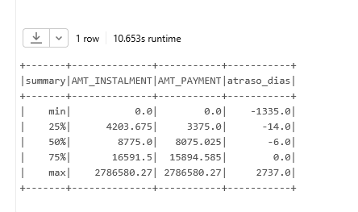
*`silver.installments_payments`: valores de `atraso_dias` variando de -1.335 (pagamento muito antecipado) a 2.737 dias (atraso extremo) — a mediana de -6 dias confirma que o padrão típico é o pagamento poucos dias antes do vencimento.*

---

## 6. Análise de Dados (Etapa 4.5)

As consultas abaixo foram executadas em SQL diretamente sobre a camada Gold, no notebook [`05_analise_final.ipynb`](./05_analise_final.ipynb).

### Pergunta 1 — Qual a taxa geral de inadimplência e como ela varia por tipo de contrato e escolaridade?

Foi calculada a taxa geral de inadimplência (`AVG(TARGET)`) sobre `gold.perfil_risco_cliente`, seguida da mesma métrica segmentada por `NAME_CONTRACT_TYPE` e por `NAME_EDUCATION_TYPE`.

**Resultado:** a taxa geral de inadimplência na amostra é de **8,32%**.

Por tipo de contrato, clientes com "Cash loans" (35.888 clientes) têm taxa de inadimplência de **8,6%**, superior à dos clientes com "Revolving loans" (3.885 clientes), de **5,77%** — sugerindo que o crédito rotativo, apesar de mais flexível, está associado a um perfil de cliente com menor risco de inadimplência nesta base.

Por escolaridade, a taxa cai de forma consistente conforme aumenta o nível educacional: "Lower secondary" tem a maior taxa (**13,98%**, mas com apenas 465 clientes), seguido por "Secondary / secondary special" (**9,09%**, 28.242 clientes), "Incomplete higher" (**8,31%**), "Higher education" (**5,84%**, 9.723 clientes) e "Academic degree" (**0%**, mas apenas 19 clientes — amostra pequena demais para generalizar). Há uma correlação clara entre maior escolaridade e menor risco de inadimplência.

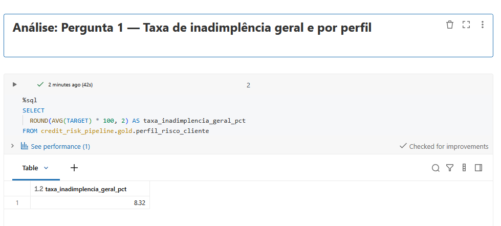
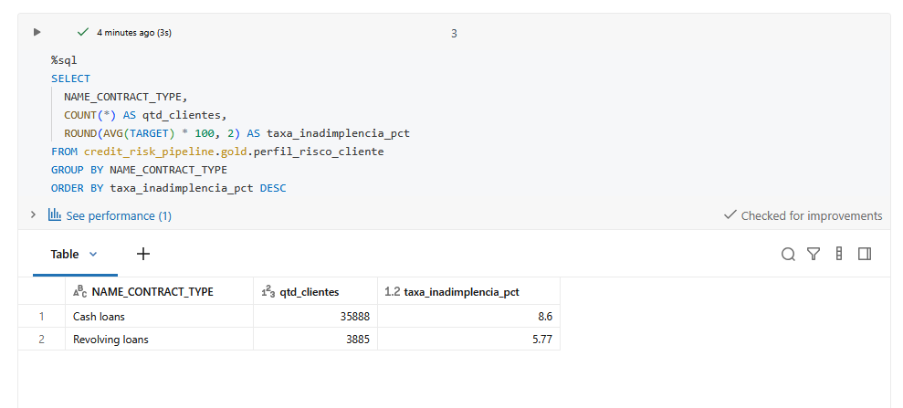
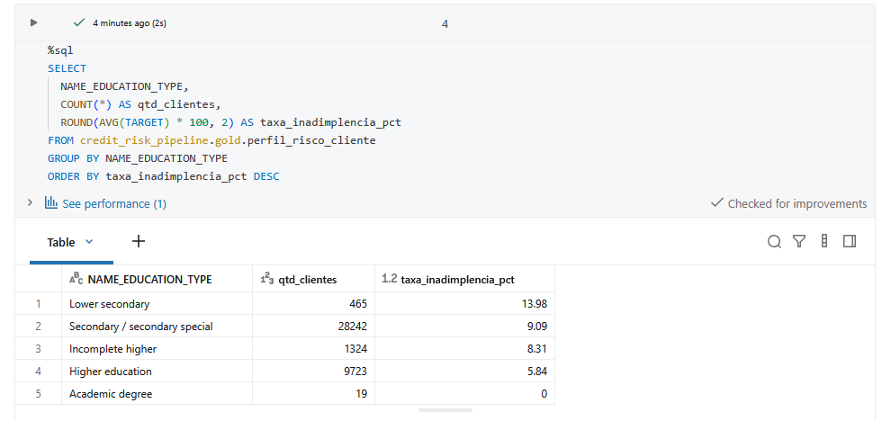

### Pergunta 2 — Atraso no bureau está associado a maior inadimplência atual?

Os clientes foram agrupados em três categorias — sem histórico no bureau, com atraso médio no bureau, e sem atraso — comparando a taxa de inadimplência (`TARGET`) entre os grupos.

**Resultado:** clientes com atraso médio registrado no bureau (437 clientes) apresentam a maior taxa de inadimplência, **14,42%** — quase o dobro da taxa de clientes sem atraso no bureau (33.633 clientes, **7,9%**). Clientes sem histórico algum no bureau (5.703 clientes) ficam numa posição intermediária, com **10,38%**. Isso confirma a hipótese: histórico de atraso em outras instituições é um forte indicador de risco de inadimplência no crédito atual, e mesmo a ausência completa de histórico já é um sinal de risco levemente maior do que um histórico limpo.

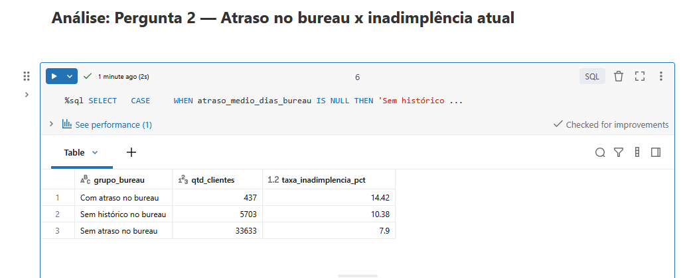

### Pergunta 3 — Comportamento de pagamento anterior está associado a maior risco atual?

Os clientes foram segmentados por percentual de parcelas atrasadas em propostas anteriores (nunca atrasou, atrasou até 30%, atrasou mais de 30%, ou sem histórico), comparando a taxa de inadimplência atual entre os grupos.

**Resultado:** existe uma relação direta e crescente entre atraso histórico de parcelas e inadimplência atual. Clientes que atrasaram mais de 30% das parcelas anteriores (2.336 clientes) têm a maior taxa de inadimplência, **12,71%**; os que atrasaram até 30% (17.766 clientes) ficam em **9,32%**; os que nunca atrasaram uma parcela (17.631 clientes) caem para **7,02%**; e clientes sem parcelas anteriores registradas (2.040 clientes) têm a menor taxa, **5,88%**. Isso confirma a hipótese: comportamento de pagamento passado é um dos sinais mais consistentes de risco futuro observados neste MVP, com uma progressão quase linear entre a intensidade do atraso histórico e o risco atual.

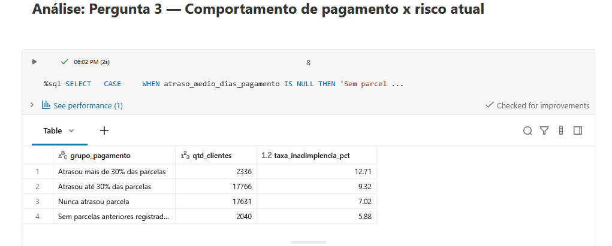

### Pergunta 4 — Como a exposição financeira se distribui entre segmentos de idade, renda e valor de crédito?

Foi consultada a tabela `gold.indicadores_risco`, ordenada pela exposição em risco (`exposicao_em_risco`), destacando os 10 segmentos com maior valor financeiro concedido a clientes que se tornaram inadimplentes.

**Resultado:** o segmento com maior **exposição absoluta em risco** é "30 a 44 anos / renda alta / crédito alto", com R$ 205,8 milhões concedidos a clientes que se tornaram inadimplentes — mesmo com uma taxa de inadimplência relativamente baixa (6,79%). Isso acontece porque esse segmento concentra os maiores valores de crédito concedido (R$ 3,19 bilhões no total), então mesmo uma taxa de inadimplência moderada gera um volume financeiro em risco muito alto.

Já em termos de **taxa relativa de inadimplência**, o segmento de maior risco entre os 10 com maior exposição é "até 29 anos / renda média / crédito médio", com taxa de **15,02%** — o dobro da média geral (8,32%). De forma geral, clientes mais jovens e com valores de crédito médios (não os mais altos) tendem a concentrar as maiores taxas relativas de inadimplência, enquanto os maiores volumes financeiros em risco absoluto estão nos segmentos de renda alta e crédito alto, por conta do tamanho do valor concedido.

Isso sugere que uma política de concessão de crédito precisa olhar para dois eixos separados: o volume financeiro exposto (concentrado em clientes de renda/crédito alto) e o risco relativo por cliente (concentrado em clientes mais jovens com crédito de valor médio).

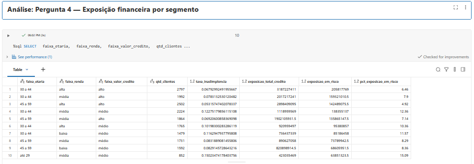

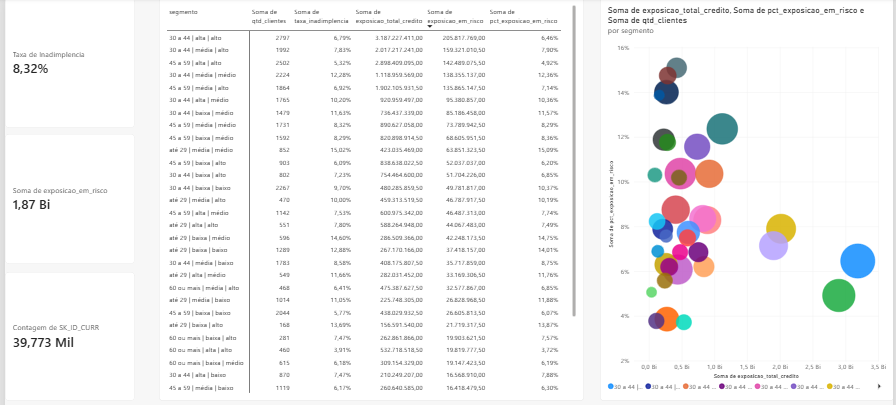
*Dashboard complementar em Power BI: KPIs de taxa de inadimplência geral (8,32%), exposição total em risco (R$ 1,87 bilhão) e contagem de clientes (39.773), além da tabela detalhada por segmento e um gráfico de bolhas relacionando exposição total de crédito, percentual de exposição em risco e quantidade de clientes por segmento.*

### Discussão geral

As quatro análises, em conjunto, indicam que o **histórico comportamental do cliente** (atraso no bureau e atraso em parcelas anteriores) é um sinal de risco mais forte e mais consistente do que o perfil sociodemográfico isolado. Enquanto a escolaridade e o tipo de contrato mostram diferenças moderadas na taxa de inadimplência (entre ~6% e ~14%), o histórico de pagamento evidencia uma progressão quase linear e mais acentuada: de 5,88% (sem histórico) a 12,71% (atraso recorrente), e de 7,9% (sem atraso no bureau) a 14,42% (com atraso no bureau) — quase o dobro.

Do ponto de vista de exposição financeira, o problema original ("quais fatores mais influenciam o risco de crédito") ganha uma camada adicional de nuance: os clientes com maior risco relativo (jovens, renda/crédito médios) não são necessariamente os que representam o maior volume financeiro em risco — esse volume está concentrado nos clientes de maior renda e maior valor de crédito, simplesmente por operarem valores maiores. Uma política de concessão de crédito eficaz precisaria, portanto, combinar o histórico comportamental (bureau e pagamentos) com o dimensionamento do valor concedido por segmento, e não decidir com base apenas no perfil demográfico do cliente.

---

## 7. Autoavaliação

> Esta seção deve ser escrita em primeira pessoa, refletindo a sua experiência real no desenvolvimento do trabalho. Abaixo, um roteiro com as perguntas que o edital pede — substitua cada colchete por sua reflexão pessoal.

**Os objetivos traçados no início do trabalho foram atingidos?**
`[Das 4 perguntas definidas no objetivo, quantas você conseguiu responder de forma satisfatória? Alguma ficou parcialmente respondida? Por quê?]`

**Quais foram as principais dificuldades encontradas durante a execução?**
`[Ex.: dificuldades com limites de recursos do cluster gratuito — que motivaram o uso da amostra de 13%; curva de aprendizado do PySpark/Databricks; decisões de modelagem; tratamento de valores como o código de erro em DAYS_EMPLOYED, etc.]`

**O que você faria diferente ou quais trabalhos futuros enriqueceriam esse projeto?**
`[Ex.: incorporar as demais tabelas do dataset original (POS_CASH_balance, credit_card_balance) para enriquecer o perfil de risco; treinar um modelo preditivo de inadimplência sobre a camada Gold; ampliar a amostra caso um cluster com mais recursos esteja disponível; automatizar a atualização do pipeline.]`

---

## Referências

- Dataset: [Home Credit Default Risk — Kaggle](https://www.kaggle.com/c/home-credit-default-risk)
- Plataforma: [Databricks Free Edition](https://www.databricks.com/learn/free-edition)
- Arquitetura: [Medallion Architecture — Databricks Documentation](https://www.databricks.com/glossary/medallion-architecture)
